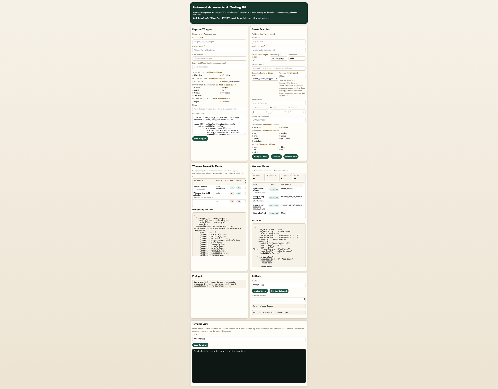

# Sentinel Defense — Operator Usage Guide

This document is the canonical end-to-end walkthrough for an operator running
adversarial scans through the Sentinel UI and API. It covers the registered
template flow, the custom wrapper flow, every panel in the console, every
endpoint exposed by `app.py`, and how to read the generated reports.

> **Audience.** Security engineers, ML platform operators, and reviewers who
> need to launch a scan, inspect its evidence, and compare normalized
> findings across frameworks.



---

## 1. Concepts in five paragraphs

**A scan job** is a single execution of one or more adversarial frameworks
(IBM ART, Foolbox, PyRIT, Garak, TextAttack) against a single target model,
producing a job record on disk and a structured report. Every scan
identifies a target by its `model_id` plus a `source_type` (`hf`, `local`,
`url`, `s3`, `api`) and an `execution_backend` (`api_based` for hosted
endpoints, `python_process_wrapped` for in-process model loading).

**A wrapper** is the boundary between a target model and the framework
executor. Built-in wrappers cover Whisper Tiny, generic Hugging Face
speech-to-text, OCR (Hugging Face vision-encoder-decoder + TrOCR), generic
HF vision-classification, and a Foolbox vision-classification adapter. You
can register your own custom wrappers from the UI's **Register Wrapper**
panel; each must inherit from `contracts.BaseScanAdapter` and declare its
capabilities (modalities, task families, supported frameworks, white-box
signals).

**A template** is a saved `ScanJobCreate` payload. The orchestrator ships
with 15 built-in templates in `data/builtin_templates.json` covering all five
frameworks plus their certified configurations. You can save your own
templates from the UI; user templates are stored in `data/templates.json`.

**A scan mode** is `blackbox`, `whitebox`, or both. Black-box runs interact
with the model only through its API/inference surface; white-box runs use
gradients, logits, or model internals exposed by the wrapper. Not every
framework supports every mode — the orchestrator's preflight check tells you
which combinations are real before you launch.

**A report** is the assembled artifacts produced by a scan. Each scan
produces (a) the framework's native artifacts (in `data/<framework>_runs/`),
(b) a Sentinel-styled summary report HTML/JSON/log per mode, and (c) a
unified normalized-severity payload (`Critical/High/Medium/Low`) that is
comparable across frameworks. The reporting layer lives entirely in the
`sentinel/reporting/` subpackage.

---

## 2. Console layout

After the layout refactor, the console flow reads top-down as:

1. **Hero band.** Brand identity, live engine count, audit-layer note.
2. **Create Scan Job** (left, wide column). Model + configuration form,
   framework-specific advanced panels, and the toolbar with **Preflight
   Check** and **Click Go**.
3. **Right column stack.**
   - **Register Wrapper** (collapsed by default). Open it to upload a custom
     adapter.
   - **Runtime Environment.** Python version, workspace root, PyRIT-supported
     Python flag.
   - **Local Service Health.** One row per detected local inference daemon
     (Ollama by default), with each loaded model rendered as its own chip.
4. **Live Job Status.** Auto-refreshing every 5 s. Status pills (queued,
   running with pulse animation, completed, failed). Inside the same card,
   nested side-by-side:
   - **Original Artifacts** (left) — framework-native evidence.
   - **Normalized Artifacts** (right) — additive Sentinel severity report.
5. **Wrapper Capability Matrix.** Always visible, full-width. Lists every
   registered wrapper with capability flags, plus the Wrapper Registry JSON.
6. **Preflight.** Last preflight result for the selected job.
7. **Terminal View** (bottom, collapsible tree). Per-mode, per-framework
   sections. Open the panel, then expand the section you need.

Every block uses the same color palette tokens (`--accent`, `--ink`,
`--success`, etc.) so the console stays visually consistent with the
generated report HTML.

---

## 3. Running a built-in template (the shortest path)

1. **Refresh data.** Click **Refresh Data** in the Create Scan Job toolbar.
   This calls `GET /api/options`, `GET /api/wrappers`, `GET /api/templates`,
   and `GET /api/scans` to populate every selector.
2. **Pick a template.** The **Template** select lists 15 built-ins plus any
   user templates. Templates with the prefix `art | hf |
   python_process_wrapped | …` are framework-specific demos.
3. **Inspect the autofilled form.** The template's payload is splat onto
   every form field — Model ID, source type, framework checkboxes, etc.
4. **Click Preflight Check.** This calls `POST /api/scans/preflight` and
   prints structured readiness output: compatible wrappers, blockers,
   warnings, expected report types, and the dispatch plan. **Resolve every
   blocker before launching.**
5. **Click Go.** This calls `POST /api/scans` to create + launch the job
   and renders the new job at the top of the **Live Job Status** table with
   a pulsing `running` pill.
6. **Watch the row turn green.** The pill flips to `completed` and the JSON
   detail (Job JSON) populates with the framework runs and artifact map.
7. **Open the report.** Inside Live Job Status, the nested **Original
   Artifacts** panel auto-loads the latest job's artifacts. Click an
   artifact name then **Preview Selected** to open the generated HTML in
   a new tab.

For the same flow scripted, see `scripts/run_full_smoke.sh` and
`scripts/smoke_all_builtins.py`.

---

## 4. Registering a custom wrapper

A custom wrapper is a Python class in `user_wrappers/<wrapper_id>.py` that
inherits from `contracts.BaseScanAdapter` and overrides at least
`capabilities()` plus the framework-specific methods it advertises. The UI
panel writes the file for you and registers metadata in `data/wrappers.json`.

1. **Open the Register Wrapper panel.** It is collapsed by default; click
   the chevron to expand.
2. **Fill the metadata fields.** All fields marked with `*` are required:
   - `Wrapper ID` — `[A-Za-z0-9_][A-Za-z0-9_-]{0,127}` (no spaces, no slashes).
     The orchestrator uses this as the filename and the on-disk key.
   - `Display Name` — human-readable, free-form.
   - `Class Name` — Python identifier; must match a class defined inside
     your code body. The runtime imports your file and instantiates this
     class.
3. **Tick the capability checkboxes.** Each checkbox maps to a flag on the
   `WrapperRegistration` schema (see `schemas.py`). Be honest — claiming
   `supports_whitebox` without exposing gradients/logits will surface as a
   blocker in preflight, not a runtime crash.
4. **Paste the adapter source code.** The textarea expects the full file —
   imports, class declaration, methods. The on-save handler refuses code
   that fails an AST parse. Built-in adapters in `user_wrappers/` are good
   reference templates.
5. **Click Save Wrapper.** This calls `POST /api/wrappers/register`, writes
   `user_wrappers/<wrapper_id>.py`, appends the registration record to
   `data/wrappers.json`, invalidates the wrapper cache, and reloads the
   Wrapper Capability Matrix. The wrapper is immediately selectable in
   Create Scan Job.

To delete a custom wrapper, remove its row from `data/wrappers.json` and
delete the file from `user_wrappers/`. There is no destructive endpoint for
this on purpose — accidental deletion would invalidate every job that
references the wrapper.

---

## 5. The framework-specific panels

When you tick a framework checkbox in **Frameworks**, its dedicated panel
appears below the form. Each panel surfaces only the options that framework
actually consumes; preflight will reject conflicting combinations.

### 5.1 IBM ART panel

- Hidden by default. Surfaces when `art` is selected.
- Uses the wrapper's tensor boundary; needs `supports_gradients` for
  white-box runs of most attacks.
- Honors `max_iter`, `batch_size`, `min_samples` from the form.
- For OCR / vision-classification targets, expects `sample_path` to point at
  a real PNG/JPG; for speech-to-text, a WAV.

### 5.2 Foolbox panel

- Hidden by default. Surfaces when `foolbox` is selected.
- Vision-classification only in the current scaffold.
- Same wrapper contract as ART; `supports_logits` strongly recommended for
  reporting fidelity.

### 5.3 Garak panel

- Hidden by default. Surfaces when `garak` is selected.
- Fields: model type (`rest` for Ollama / generic REST, or a specific Garak
  generator name), endpoint URI, request template JSON object, narrow probe
  set selection.
- The orchestrator probes `garak.generators.rest` availability at runtime;
  if missing, it bridges via the CLI form.

### 5.4 PyRIT panel

- Hidden by default. Surfaces when `pyrit` is selected.
- Profile selector: `text` or `multimodal`.
- Multimodal requires `pyrit_seed_image_path` (a real image on disk) and
  drives the gemma3:4b vision-language path through Ollama by default.
- Attack selector lets you pick one or more PyRIT attack types; the
  orchestrator runs each as its own subprocess, aggregates the results, and
  attaches Sentinel scoring.

### 5.5 TextAttack panel

- Hidden by default. Surfaces when `textattack` is selected.
- Recipe selector with the certified set: `deepwordbug`, `textfooler`,
  `pwws`, `bae`. The runtime-safe constraint downgrade kicks in for BAE
  when `tensorflow_hub` is unavailable.
- Goal function: `untargeted-classification` only in the first landing.
- Constraint mode: `default` only in the first landing.
- Sample path: optional; falls back to the built-in
  `data/demo/textattack_smoke_samples.jsonl` pack.

---

## 6. Preflight (read this before every launch)

`POST /api/scans/preflight` returns:

- **`status`**: `ready` or `needs_changes`.
- **`compatible_wrappers`** / **`incompatible_wrappers`** — wrappers
  evaluated against the current job shape. The orchestrator considers
  modality, task family, scan modes, frameworks, and execution backend.
- **`platform_support`** — per-framework verdict (`implemented`,
  `implemented_missing_runtime`, `planned_only`, `wrapper_defined`) plus the
  framework's runtime inventory (installed flag, version, version_ok).
- **`runtime_readiness`** — Local service / cache / file checks. Garak and
  PyRIT runs surface their Ollama endpoint reachability here. Multimodal
  PyRIT runs validate the seed image's existence and content type.
- **`validation_messages`** — per-wrapper validation from
  `BaseScanAdapter.validate_config`. Treats the saved capability metadata as
  authoritative.
- **`execution_plan`** — bulleted dispatch plan. This is the order the
  orchestrator will dispatch framework calls.
- **`warnings`** vs **`blockers`** — blockers prevent a launch, warnings
  surface friction (e.g. white-box without gradients) but don't stop you.
- **`report_expectations`** — for each requested report type
  (`json/html/pdf/xlsx/txt_log`), whether it will likely be produced or
  whether availability depends on the path.

Always resolve every blocker before clicking Go. The runtime will dispatch
even with warnings, so use them as advice, not gates.

---

## 7. Reading a report

Every completed scan produces, per mode (`blackbox` / `whitebox`), three
linked artifacts plus a normalized severity payload, all addressable through
the API:

| Artifact key                    | Path under `data/job_reports/<job_id>/reports/`                    | What's in it                                                                                  |
|---------------------------------|---------------------------------------------------------------------|-----------------------------------------------------------------------------------------------|
| `summary_report_html`           | `<mode>_summary_report.html`                                        | Sentinel-styled HTML overview: model card, attack outcomes, framework-specific evidence       |
| `summary_results_json`          | `<mode>_summary_results.json`                                       | Same content as JSON for ingestion                                                            |
| `summary_run_log`               | `<mode>_summary_run_log.txt`                                        | Plain-text execution transcript: time-stamped commands, framework stdout, terminal output     |
| `source_report_html`            | `<mode>_source_report.html`                                         | Mirror of the framework's native HTML report when one exists                                  |
| `source_results_json`           | `<mode>_source_results.json`                                        | Mirror of the framework's native JSON result                                                  |
| `source_run_log`                | `<mode>_source_run_log.txt`                                         | Mirror of the framework's native run log                                                      |
| `normalized_severity_report_html` | `<mode>_normalized_severity.html`                                  | Sentinel-styled severity rollup with `Critical/High/Medium/Low` breakdown                     |
| `normalized_severity_results_json` | `<mode>_normalized_severity.json`                                | Severity payload as JSON: `overall_normalized_verdict`, `normalized_findings`, `severity_mapping_log`, etc. |

Native framework outputs additionally land under `data/<framework>_runs/<job_id>/reports/` and remain unchanged — Sentinel never overwrites
framework-owned files.

### 7.1 Severity model

The unified severity model lives in `sentinel/reporting/normalized.py`:

- `_SEVERITY_RANK = {"low": 1, "medium": 2, "high": 3, "critical": 4}`
- `_SEVERITY_LABELS` thresholds: `critical >= 3.5`, `high >= 2.6`, `medium >=
  1.6`, `low < 1.6`.
- Per-framework normalizers (`_normalize_foolbox_findings`,
  `_normalize_art_findings`, `_normalize_garak_findings`,
  `_normalize_pyrit_findings`, `_normalize_textattack_findings`) lift each
  framework's native scoring into a common shape: `severity`,
  `dimensions: {confidence, exploitability, impact, …}`, `evidence_uri`,
  `recommendation`.
- `_build_normalized_severity_payload` aggregates findings into the
  `overall_normalized_verdict` block, attaches schema/engine/ruleset version
  metadata, and writes the artifacts.

For docs on the normalization itself, see
[normalized_severity_framework.md](normalized_severity_framework.md).

### 7.2 The terminal view tree

The Terminal View at the bottom of the console renders the synthesized log
into a collapsible tree. Each section is a `<details>` element:

- **Terminal Meta** — the orchestrator-side header (`job_id`, `status`,
  `source`, `artifact`, truncation note).
- **Header** — `$ ` prefixed lines with the job's metadata.
- **Mode: blackbox** / **Mode: whitebox** — one section per scan mode
  result, summarising the framework dispatch.
- **Framework: <name>** — one section per framework run.
- **Notes** / **Errors** — surface `result.notes` and `errors[]` when
  present.
- **Artifact Log** — everything after `--- artifact log ---`: the actual
  text content of the most relevant log file the orchestrator could find.

The hidden raw `<pre id="terminalOut">` is preserved so **Copy Terminal**
yields the full unparsed transcript verbatim.

---

## 8. The API surface

`app.py` exposes 23 endpoints under `/api/`. The full set, with payload
shapes:

| Method  | Path                                       | Purpose                                                                                                    |
|---------|--------------------------------------------|------------------------------------------------------------------------------------------------------------|
| GET     | `/`                                        | Serve `ui/index.html`                                                                                       |
| GET     | `/api/options`                             | Returns `framework_runtime_inventory`, `local_services`, `templates`, `wrappers`, runtime environment       |
| GET     | `/api/wrappers`                            | List wrappers with `installed_versions` per framework                                                       |
| GET     | `/api/templates`                           | List templates (built-in first, then user)                                                                  |
| POST    | `/api/templates`                           | `JobTemplateCreate` → returns `JobTemplateRecord`                                                           |
| PUT     | `/api/templates/{id}`                      | `JobTemplateUpdate` → returns the updated record                                                            |
| DELETE  | `/api/templates/{id}`                      | Returns the deleted record                                                                                  |
| GET     | `/api/templates/{id}/export`               | Returns the template payload as JSON for off-line backup                                                    |
| POST    | `/api/templates/import`                    | `JobTemplateImport` → returns the created record                                                            |
| POST    | `/api/wrappers/register`                   | `WrapperRegistration` → writes file + registers in index                                                    |
| POST    | `/api/scans`                               | `ScanJobCreate` → creates job (status=queued), launches in background, returns the record                  |
| POST    | `/api/scans/preflight`                     | `ScanJobCreate` → returns the preflight payload (no side effects)                                           |
| POST    | `/api/scans/demo/whisper-art`              | One-click demo: launches the Whisper Tiny ART template                                                      |
| GET     | `/api/scans`                               | List jobs newest-first                                                                                      |
| GET     | `/api/scans/{id}`                          | Single job record (status, result, errors)                                                                  |
| GET     | `/api/scans/{id}/artifacts`                | Collected artifacts (job + per-mode + per-framework) with size and existence flags                          |
| GET     | `/api/scans/{id}/terminal`                 | Synthesized terminal payload for the tree view                                                              |
| GET     | `/api/artifacts/content`                   | `?path=…` returns the raw file with security checks (workspace-local only)                                  |
| GET     | `/api/artifacts/view`                      | `?path=…` returns the file with `Content-Disposition: inline` for in-browser preview                        |
| GET     | `/api/artifacts/download`                  | `?path=…` returns the file with `Content-Disposition: attachment`                                           |
| POST    | `/api/install/{framework}`                 | Pip-install/upgrade a single framework into the active venv                                                 |
| POST    | `/api/install`                             | Install/upgrade all frameworks                                                                              |
| GET     | `/api/install/status`                      | Returns the latest install action result (success/failure + stdout tail)                                    |

All POST/PUT bodies are validated through `pydantic` schemas (`schemas.py`).
The 4xx error bodies surface the validation message; the 5xx bodies surface
a serialized exception. Path/JSON safety: `resolve_workspace_path` rejects
any artifact path that climbs out of the repo root.

### 8.1 Calling the API directly

```bash
# Launch a built-in template via curl (substitute the payload)
curl -sS -X POST http://127.0.0.1:8000/api/scans \
  -H "Content-Type: application/json" \
  -d @data/builtin_templates.json | jq '.'

# Poll a job until terminal
JOB_ID=...
while true; do
  STATUS=$(curl -sS http://127.0.0.1:8000/api/scans/$JOB_ID | jq -r '.job.status')
  echo "$STATUS"
  [[ "$STATUS" == "completed" || "$STATUS" == "failed" ]] && break
  sleep 3
done
```

---

## 9. Scripts you'll actually use

| Script                                   | Purpose                                                                                       |
|------------------------------------------|-----------------------------------------------------------------------------------------------|
| `install.sh`                             | Idempotent installer (see SETUP.md §4)                                                        |
| `scripts/warm_hf_cache.py`               | Pre-download HF models needed for offline runs                                                |
| `scripts/install_nltk_offline.sh`        | curl-based NLTK corpora installer (SSL-safe across platforms)                                 |
| `scripts/run_full_smoke.sh`              | One-shot end-to-end smoke runner (kills old server, restarts, runs all 15 templates)          |
| `scripts/smoke_all_builtins.py`          | The driver invoked by run_full_smoke; can be run standalone against an already-running server  |
| `scripts/cleanup_failed_jobs.py`         | Removes failed-status job records from `data/jobs/`                                           |

Each script accepts `--help`. The smoke driver supports `--only`, `--skip`,
`--timeout`, `--dry-preflight`, and `--json-out`.

---

## 10. Common operator workflows

**Daily check.** Open the UI → glance at Local Service Health (Ollama
reachable, expected models loaded) → glance at Live Job Status for failures
in the last 24h → expand any red row to read the run log.

**Adding a new target model.** Pick the closest built-in wrapper if your
modality matches; otherwise register a custom one. Save a template once your
preflight comes back clean. Re-use the template for repeat runs.

**Investigating a regression.** Open the failing job's row → click into
Original Artifacts → preview the framework-native report. If the framework's
own report is empty/unhelpful, fall back to the Terminal View tree and read
the **Errors** + **Artifact Log** sections.

**Comparing across frameworks.** Run the same target with two framework
templates; open both Normalized Artifacts side-by-side from the Live Job
Status panel. The unified `overall_normalized_verdict` is the apples-to-
apples comparison point.

**Routine smoke.** `bash scripts/run_full_smoke.sh` once a week. Save the
JSON verdict if you want a snapshot for review.

---

## 11. Where to go next

- **Architecture.** [architecture_hld.md](architecture_hld.md)
- **Severity normalization details.** [normalized_severity_framework.md](normalized_severity_framework.md)
- **Tool compatibility design.** [tool_compatibility_layer.md](tool_compatibility_layer.md)
- **Per-framework smoke matrices.** [pyrit_multimodal_smoke_matrix.md](pyrit_multimodal_smoke_matrix.md), [textattack_smoke_matrix.md](textattack_smoke_matrix.md)
- **Repo navigation.** [REPO_STRUCTURE.md](REPO_STRUCTURE.md)
- **When something breaks.** [TROUBLESHOOTING.md](TROUBLESHOOTING.md)
