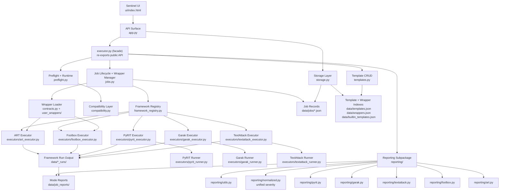

# Sentinel Adversarial Orchestrator Architecture HLD

This high-level design reflects the current shipped architecture after the
orchestration split (executor.py → templates.py + preflight.py + jobs.py +
reporting/ subpackage). executor.py is now a thin facade that re-exports every
public symbol, so existing integrations keep working unchanged.

## Goals

- keep each framework executor isolated from the others;
- keep orchestration logic separate from framework-specific runtime logic;
- keep template CRUD, preflight/runtime evaluation, job lifecycle, and report
  rendering in separate modules so each can evolve independently;
- preserve additive reporting and normalized artefacts without rewriting source
  evidence;
- let the UI, API, storage, and execution layers evolve independently;
- version-independent tool management: frameworks are addressed via
  compatibility profiles, not pinned integrations.

## High-Level Diagram

## Layer Breakdown

### 1. UI Layer

- Single-page operator console in [`ui/index.html`](../ui/index.html).
- Handles form state, preflight, job launch, live status, original artefacts,
  normalized artefacts, and terminal view.
- Presentation-focused; no framework decision logic here.

### 2. API Layer

- API endpoints in [`app.py`](../app.py).
- Responsibilities: serve UI; expose templates, wrappers, scans, artefacts,
  terminal data; enforce workspace-local artefact boundaries; return file
  responses with security headers.
- Imports always go through `executor.py`, not the split modules, so the API
  layer is insulated from internal re-organizations.

### 3. Orchestration Facade

- [`executor.py`](../executor.py) is a **facade**: it re-exports every public
  symbol from `templates.py`, `preflight.py`, `jobs.py`, and the `reporting/`
  subpackage, and retains only orchestration logic that spans multiple layers
  (`execute_job_record`, `_render_mode_summary_html`, etc.).
- This preserves every existing import path (`from sentinel.executor import X`
  continues to work) while letting each concern live in its own module.

### 4. Template Management

- CRUD + builtin sync in [`templates.py`](../templates.py).
- Responsibilities: load built-in templates from
  `data/builtin_templates.json`, save/update/delete user templates,
  import/export templates as JSON. Template IDs use full
  `uuid.uuid4().hex` to avoid collisions.

### 5. Preflight + Runtime Evaluation

- Runtime checks in [`preflight.py`](../preflight.py).
- Responsibilities: Python runtime summary, local Ollama detection, platform
  support evaluation, wrapper compatibility evaluation, framework version
  probes, and the single source-of-truth `FRAMEWORK_RUNTIME_SPECS`.

### 6. Job Lifecycle + Wrapper Manager

- Job + wrapper core in [`jobs.py`](../jobs.py).
- Responsibilities: wrapper registration, sync of built-in wrappers (cached
  and invalidated on mutation), wrapper listing with per-framework
  `installed_versions`, execution plan building, job creation / run /
  listing / reconciliation, artefact mirroring and collection.

### 7. Framework Registry

- Framework separation contract in
  [`framework_registry.py`](../framework_registry.py).
- Responsibilities: define supported framework order; store support-path
  metadata; map capability flags; dispatch built-in and adapter-backed runs.
- Main modularity seam for ART, Foolbox, PyRIT, Garak, TextAttack.

### 8. Compatibility Layer

- Compatibility metadata in [`compatibility.py`](../compatibility.py).
- Responsibilities: per-framework profiles (package name, import name,
  python requirement, known version risks, adapter strategy), feature-check
  summaries, compatibility evidence attached to runtime results.
- This is what makes tools **version-independent**: every framework has a
  profile describing how to reach it, not a pinned integration.

### 9. Framework Execution Layer

- ART and Foolbox remain wrapper-driven model-boundary executors.
- PyRIT, Garak, and TextAttack remain built-in executor flows with their own
  runner/process boundaries.
- Each framework has its own executor module under
  [`executors/`](../executors).

### 10. Storage Layer

- File-backed storage in [`storage.py`](../storage.py).
- Responsibilities: job persistence (atomic via tempfile + os.replace + fsync,
  serialized on a module-level `JOB_WRITE_LOCK` RLock so concurrent updates
  and reconciliation can't race); template index persistence; wrapper index
  persistence; wrapper source file persistence with safe identifier checks.

### 11. Reporting Subpackage

- [`reporting/`](../reporting/) contains every HTML/JSON renderer for
  per-framework evidence and the unified normalized-severity engine:
  `utils.py` (scalar/table helpers), `normalized.py` (unified severity
  rollup — Critical/High/Medium/Low across ART, Foolbox, Garak, PyRIT,
  TextAttack), and one module per framework for its native renderers.
- Reports are additive: native artefacts stay untouched, normalized
  artefacts sit beside them.

## Data Flow

1. Operator edits a job in the UI.
2. API validates payload through Pydantic schemas in `schemas.py`.
3. `preflight.build_preflight` produces runtime feedback and an execution plan.
4. On launch, `jobs.create_job` persists the record and `jobs.run_job` starts
   background execution under `JOB_WRITE_LOCK` protection.
5. Framework registry dispatches to the appropriate executor boundary.
6. Framework executor writes native artefacts into framework-specific run
   directories.
7. `reporting.*` modules synthesize mode reports, unified severity summaries,
   and terminal views beside the originals.
8. API serves reports and downloadable artefacts back to the UI.

## Design Ethos Mapping

- **Version-independent tool management** — every framework has a
  `FrameworkCompatibilityProfile` in `compatibility.py` with package
  name, import name, python requirement, known version risks, and
  adapter strategy. `preflight.FRAMEWORK_RUNTIME_SPECS` derives from these
  profiles so upgrades don't require framework logic changes.
- **Modular & scalable architecture** — executor.py went from 4,635 to
  1,552 lines by splitting orchestration into template, preflight, job,
  and reporting concerns. Each concern is independently importable and
  independently testable.
- **One-click installation** — top-level `install.sh` provides a
  deterministic setup (venv + pinned requirements + data directory
  scaffolding). `requirements-core.txt` covers the minimal API surface;
  `requirements.txt` adds framework dependencies.
- **Universal wrapper manager** — `contracts.BaseScanAdapter` plus the
  `jobs.py` wrapper registry (with per-framework `installed_versions`,
  capability flags, and supported modality/task-family arrays) give
  every tool a single shape to interact with.
- **Flexible scan execution modes** — `ExecutionBackend` literal
  (`api_based`, `python_process_wrapped`) and `ScanMode` literal
  (`blackbox`, `whitebox`) are part of `schemas.py`; framework executors
  branch on these at dispatch time.
- **World-class reporting** — `reporting/normalized.py` unifies severity
  rollups across all frameworks; `ReportName` literal covers json, html,
  pdf, xlsx, and txt_log; per-framework renderers keep native evidence
  intact alongside normalized artefacts.
- **Production-ready delivery** — private repo, pinned dependencies,
  atomic writes, module-level locking, AST-validated refactor, and
  comprehensive architecture + compatibility + deployment docs.

## Current Strengths

- Clear framework-specific executor files already exist.
- Compatibility logic is explicit and audit-friendly.
- Reporting is additive rather than destructive.
- Built-in and wrapper-backed execution can coexist.
- `executor.py` is now a facade, not a monolith.
- Job writes are atomic and serialized on a single lock.

## Current Boundaries

- UI is still a single-file application, so future component extraction
  would help maintainability.
- Storage is file-backed and local-first by design, which keeps deployment
  simple but limits concurrency semantics to the single-process case.
- Installation still requires a Python 3.11+ interpreter and a working
  compiler toolchain for ML dependencies; a container image would remove
  that requirement entirely.

## Next Safe Refactor Targets

1. Move API routes into focused route modules once response shapes are stable.
2. Introduce typed artefact/report models so report assembly is less
   dict-driven.
3. Extract UI sections into small static partials or a light component
   build step if the current single-file UI becomes harder to maintain.
4. Ship a Dockerfile + compose file to make installation truly one-click
   across environments.
